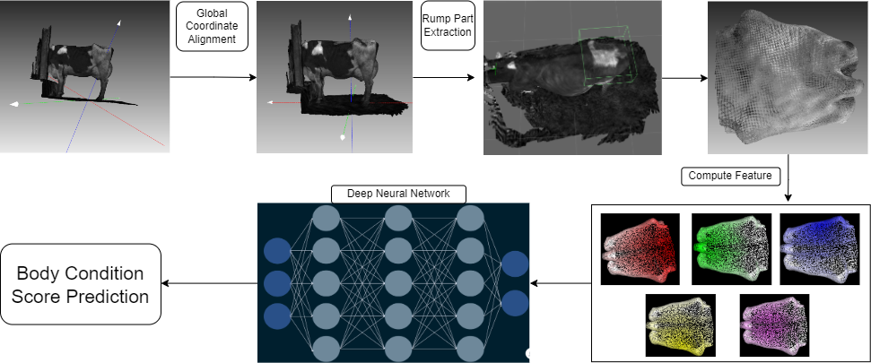
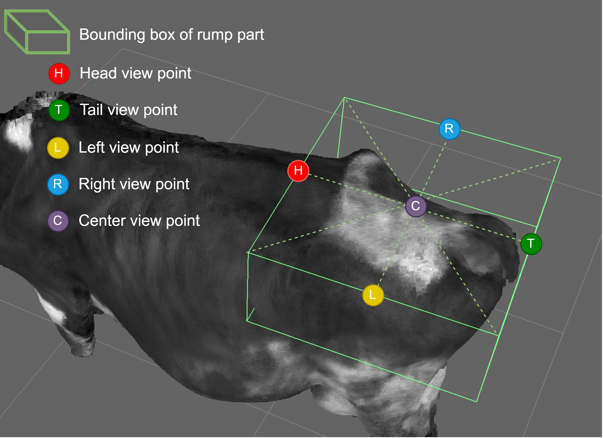

### Source for Body Condition Score Assertment of Dairy Cow using Deep Learning and 3D Imaging

#### 1. Overall process



### 2. Compute POV feature
Refer to the following files: ***./script/make_view.py*** and ***./script/make_full_view.py***.



### 3. Training
```
python train_pointnet_with_pov.py
```

### 4. Scoring
```
python scoring_by_pov.py
```
